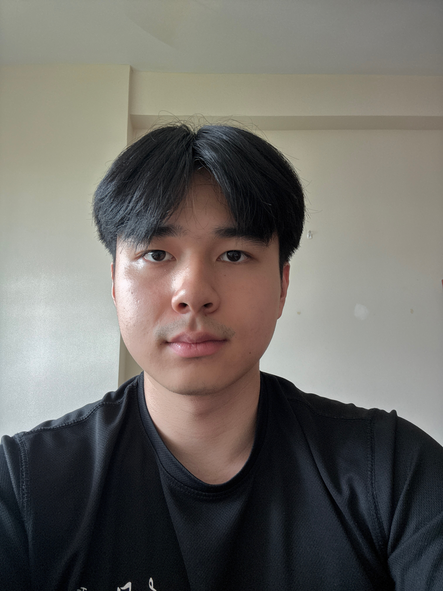
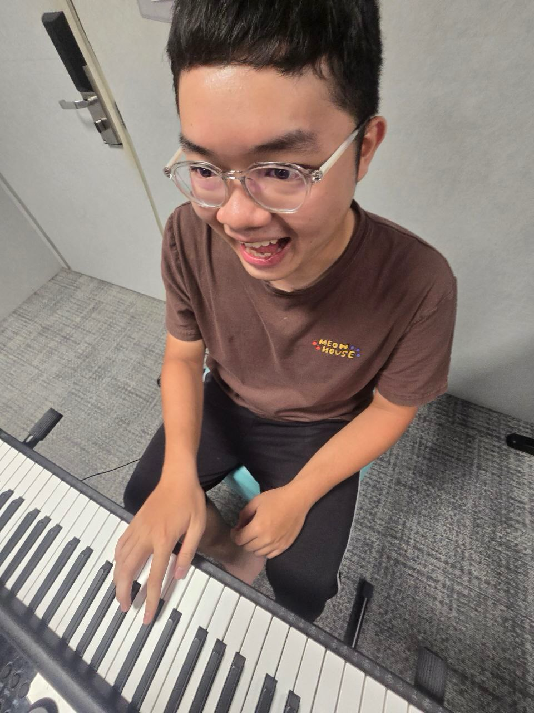
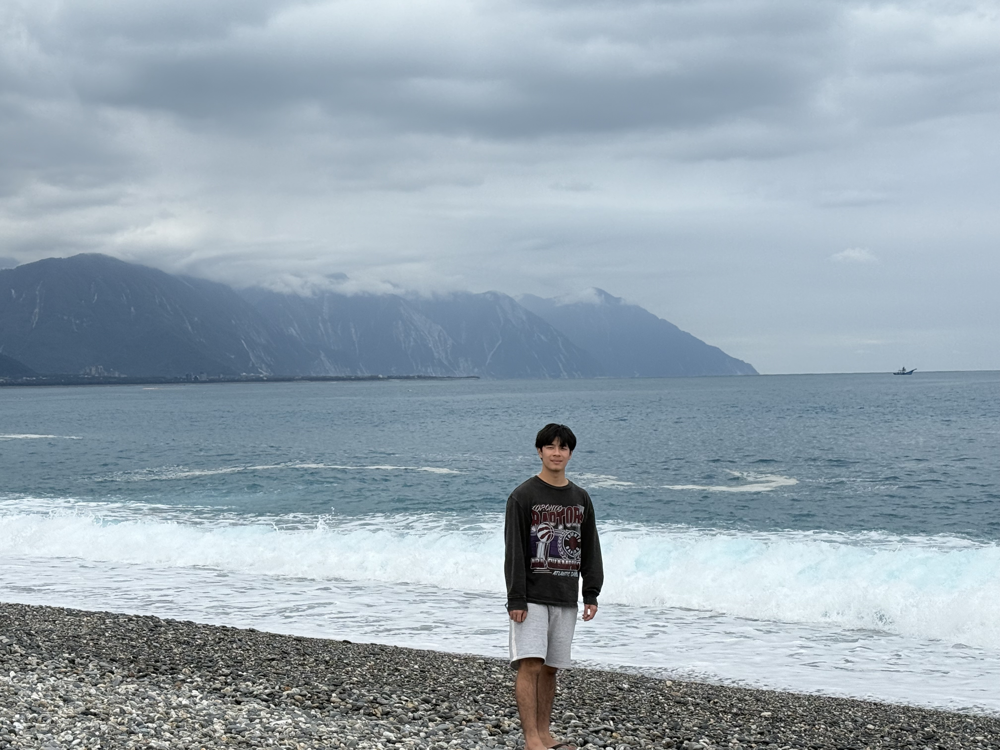
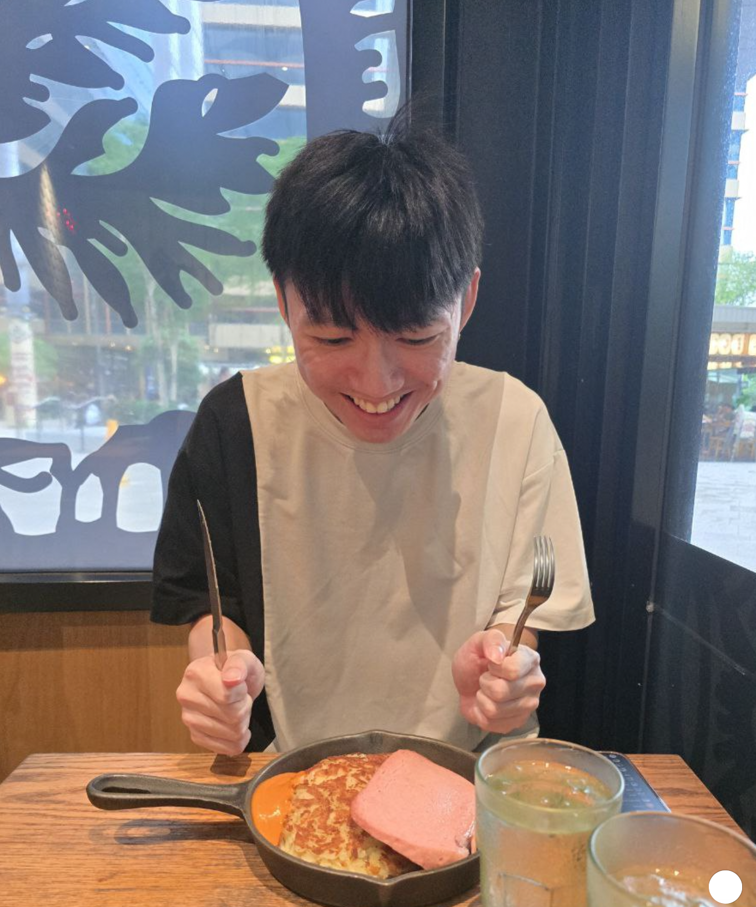

# About Us

We are a team based in the [School of Computing, National University of Singapore](http://www.comp.nus.edu.sg).

You can reach us at the email `seer[at]comp.nus.edu.sg`

## Project team

### Cheneil Gallardo Lee

[[github](https://github.com/Gallardo166)]

* Role: Project Advisor

### Louis Christopher Yu

[[github](http://github.com/johndoe)]
[[portfolio](team/johndoe.md)]

* Role: Team Lead
* Responsibilities: UI

### Ong Jia Cheng

[[homepage](https://www.tinyurl.com/ongjiacheng)]
[[github](http://github.com/ongjiacheng)]
[[portfolio](team/jiacheng.md)]

* Role: Developer
* Responsibilities: Data Science

### Toh Yi Sheng

[[github](http://github.com/yishengt)]
[[portfolio](team/johndoe.md)]

* Role: Developer
* Responsibilities: UI

### Wong Li Ren

[[github](http://github.com/oofyneril)]
[[portfolio](team/liren.md)]

* Role: Developer
* Responsibilities: Dev Ops + Threading
