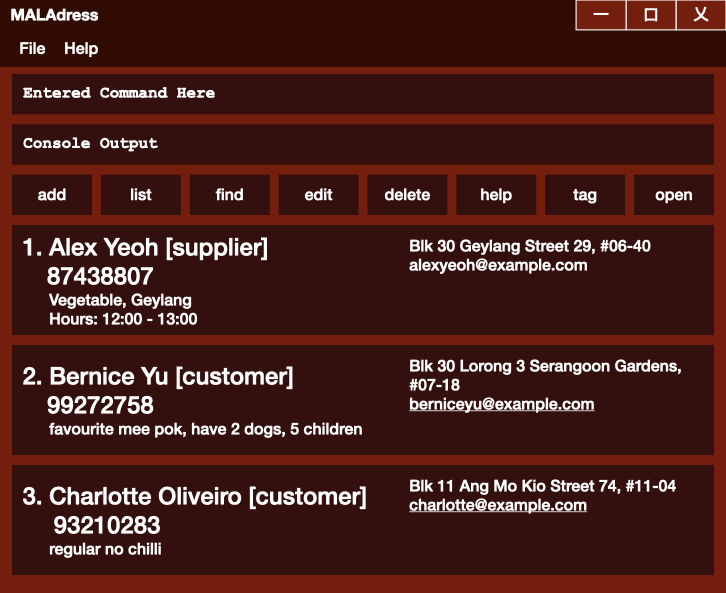

# MALAddress User Guide

MALAddress is a **desktop app for managing contacts**, optimized for **fast CLI workflows** while still having the benefits of a **GUI**. It is adapted from AddressBook Level 3 (AB3) and is designed for **hawker stall owners and stall staff** managing **suppliers** and **regular customers**.

<!-- * Table of Contents -->
<page-nav-print />

--------------------------------------------------------------------------------------------------------------------

## Quick start

1. Ensure you have Java `17` or above installed in your computer. 
   **Mac users:** Ensure you have the precise JDK version prescribed [here](https://se-education.org/guides/tutorials/javaInstallationMac.html).

1. Download the latest `.jar` file from your team’s GitHub Releases page.

1. Copy the file to the folder you want to use as the _home folder_ for MALAddress.

1. Open a terminal, `cd` into the folder you put the jar file in, and run:
   `java -jar maladdress.jar` 
   A GUI similar to the below should appear in a few seconds. Note how the app may contain sample data. 
   

1. Type the command in the command box and press Enter to execute it. e.g. typing **`help`** and pressing Enter will show available commands, while **`help add`** will show the format for the `add` command. 
   Some example commands you can try:

   * `list` : Lists all contacts.
   * `add n/Ah Seng Veggies p/91234567 t/supplier t/vegetables r/leadtime:2d hours:0700-1700` : Adds a supplier contact.
   * `find vegetables` : Finds contacts matching the keyword.
   * `tag 1 t/customer t/regular r/no chilli` : Tags the 1st contact and adds a note.
   * `open` : Lists suppliers who are currently open (based on stored operating hours).
   * `delete 3` : Deletes the 3rd contact shown in the current list.

1. Refer to the [Features](#features) below for details of each command.

--------------------------------------------------------------------------------------------------------------------

## Features

<box type="info" seamless>

**Notes about the command format:** 

* Words in `UPPER_CASE` are the parameters to be supplied by the user. 
  e.g. in `add n/NAME`, `NAME` is a parameter which can be used as `add n/John Doe`.

* Items in square brackets are optional. 
  e.g `n/NAME [t/TAG]` can be used as `n/John Doe t/friend` or as `n/John Doe`.

* Items with `…` after them can be used multiple times including zero times. 
  e.g. `[t/TAG]…` can be used as ` ` (0 times), `t/friend`, `t/friend t/family` etc.

* Parameters can be in any order. 
  e.g. if the command specifies `n/NAME p/PHONE`, `p/PHONE n/NAME` is also acceptable.

* If you are using a PDF version of this document, be careful when copying and pasting commands that span multiple lines as space characters surrounding line-breaks may be omitted when copied over to the application.
</box>

### Viewing help : `help`

Shows the correct format and example(s) for a command.

Format:
* `help`
* `help COMMAND`

Examples:
* `help`
* `help add`
* `help tag`
* `help open`

---

### Adding a contact: `add`

Adds a contact (supplier or customer) to MALAddress.

Format: `add n/NAME p/PHONE [e/EMAIL] [a/ADDRESS] [t/TAG]… [r/REMARK]`

Notes:
* `t/` can be used multiple times.
* Use `t/supplier` and supply-type tags (e.g., `t/vegetables`) to classify suppliers.
* Use `t/customer` and `t/regular` to classify customers.
* Use `r/` to store short notes (e.g., preferences, hours, lead time).

Examples:
* `add n/Ah Seng Veggies p/91234567 t/supplier t/vegetables r/leadtime:2d hours:0700-1700`
* `add n/Wei Ming p/81234567 t/customer t/regular r/no chilli`

---

### Listing all contacts : `list`

Shows a list of all contacts in MALAddress.

Format: `list`

---

### Editing a contact : `edit`

Edits an existing contact in MALAddress.

Format: `edit INDEX [n/NAME] [p/PHONE] [e/EMAIL] [a/ADDRESS] [t/TAG]… [r/REMARK]`

Notes:
* Edits the contact at the specified `INDEX`.
* The index refers to the index number shown in the displayed contact list.
* The index **must be a positive integer** 1, 2, 3, …
* At least one optional field must be provided.
* Existing values will be updated to the input values.
* When editing tags, the existing tags will be replaced (i.e., tag edits are not cumulative).

Examples:
* `edit 1 p/91234567 e/johndoe@example.com`
* `edit 2 t/supplier t/seafood r/leadtime:1d hours:0900-1800`

---

### Finding contacts: `find`

Finds contacts whose fields contain any of the given keywords.

Format: `find KEYWORD [MORE_KEYWORDS]`

Search behaviour:
* The search is case-insensitive.
* Keywords can match any of: **name, phone, email, address, tags, remark**.
* Contacts matching at least one keyword will be returned (`OR` search).

Examples:
* `find supplier`
* `find vegetables`
* `find 9123`
* `find regular chilli`

---

### Tagging a contact as customer/supplier: `tag`

Updates tags and/or remark for a contact.

Format: `tag INDEX [t/TAG]… [r/REMARK]`

Notes:
* If `t/` appears at least once, it replaces all existing tags with the new set.
* If no `t/` is provided, tags remain unchanged.
* If `r/` is provided, it replaces the existing remark.
* If no `r/` is provided, the remark remains unchanged.
* Use `r/-` to clear the remark.

Examples:
* `tag 1 t/supplier t/vegetables r/Yishun hours:1200-1300`
* `tag 2 t/customer t/regular r/no chilli`

---

### Listing currently available suppliers : `open`

Lists suppliers that are currently open (available) based on stored operating hours.

Format: `open`

Notes:
* A supplier is a contact with tag `supplier`.
* This feature uses operating hours stored in remarks (e.g., `hours:0700-1700`).
* Suppliers without operating hours in the expected format may be excluded.

Example:
* `open`

---

### Deleting a contact : `delete`

Deletes the specified contact from MALAddress.

Format: `delete INDEX`

Notes:
* Deletes the contact at the specified `INDEX`.
* The index refers to the index number shown in the displayed contact list.
* The index **must be a positive integer** 1, 2, 3, …

Example:
* `delete 3`

---

### Saving the data

MALAddress data is saved automatically to the hard disk after any command that changes the data. There is no need to save manually.

### Editing the data file

Data is saved automatically as a JSON file at `[JAR file location]/data/addressbook.json`.
Advanced users may edit the data file directly, but invalid edits may cause MALAddress to discard data and start with an empty file on the next run.

<box type="warning" seamless>

**Caution:**  
If your changes make the data file format invalid, MALAddress may discard all data and start with an empty data file at the next run. Back up the file before editing it.
</box>

--------------------------------------------------------------------------------------------------------------------

## FAQ

**Q**: How do I transfer my data to another computer? 
**A**: Install the app on the other computer and overwrite the empty data file it creates with the data file from your previous MALAddress home folder.

--------------------------------------------------------------------------------------------------------------------

## Known issues

1. **When using multiple screens**, the GUI may open off-screen after changing display configurations. Remedy: delete the `preferences.json` file before running the app again.
2. **If you minimize the Help Window** (if implemented as a window) and run `help` again, the help window may remain minimized. Remedy: restore it manually.

--------------------------------------------------------------------------------------------------------------------

## Command summary

Action   | Format, Examples
---------|----------------------------------------------------------------------------------------------------------------------------------------------------------------------
**Add**  | `add n/NAME p/PHONE [e/EMAIL] [a/ADDRESS] [t/TAG]… [r/REMARK]`   e.g., `add n/Ah Seng Veggies p/91234567 t/supplier t/vegetables r/leadtime:2d hours:0700-1700`
**List** | `list`
**Find** | `find KEYWORD [MORE_KEYWORDS]`  e.g., `find vegetables`
**Edit** | `edit INDEX [n/NAME] [p/PHONE] [e/EMAIL] [a/ADDRESS] [t/TAG]… [r/REMARK]`  e.g., `edit 2 t/customer t/regular r/no chilli`
**Tag**  | `tag INDEX [t/TAG]… [r/REMARK]`  e.g., `tag 1 t/supplier r/hours:0700-1700`
**Open** | `open`
**Delete** | `delete INDEX`  e.g., `delete 3`
**Help** | `help` / `help COMMAND`  e.g., `help add`
